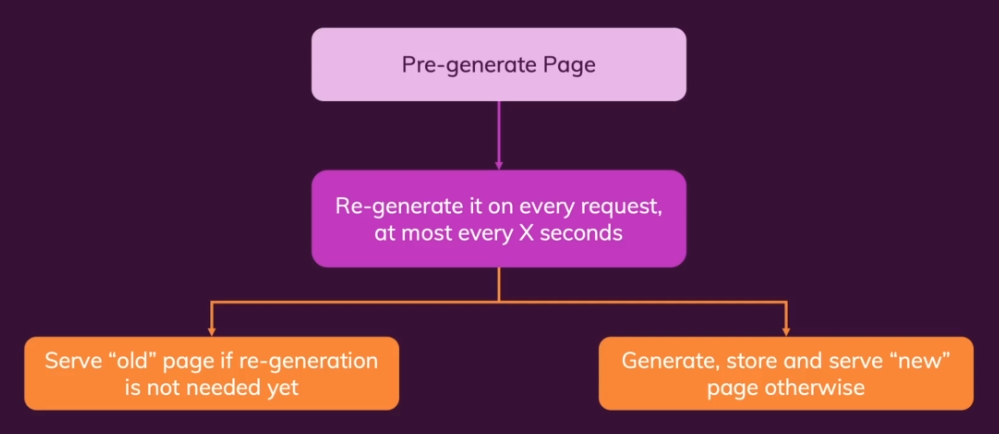
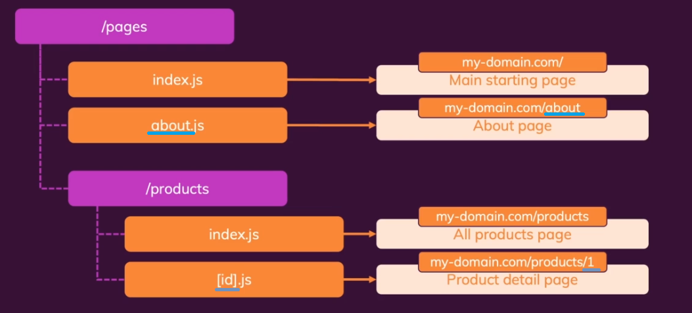

<h1>Next.js</h1>

Next.js renders our pages with initial data that helps us avoid an initial
loader. This allows for better SEO as well. It fetches data on the server
and renders finished pages. After that you're still going to enter the usual
flow of a React app. There are two forms of pre-rendering - static generation,
and server-side rendering. With static generation all the pages are pre-generated
in advance during build time. With server-side rendering the pages are created
just in time. We have a special function that we can use to tell Next.js inside
our page components what are the props that are needed for page pre-rendering.
`export async function getStaticProps(context)...`. The name matters. It's a function
that Next.js will watch out for. You're not restricted to client side code there.
In fact, you're running server code there. You don't even have the window object.
Any code you put in here will not be included in the bundle. It'll never be seen
by your clients. You can include credentials and access the file system.
By default, Next.js pre-renders all pages that have no dynamic data.
By default, the `getStaticProps` method is run only during the build. This means
that whatever you put in it will be called only once during build time. So if
you have DB calls in it, then the data will probably be outdated when rendering.
So, should have data query calls in the component as well.
However, this isn't the only option. ISR is incremental static generation. It
allows for page re-generation on every request, at most every X seconds.
`revalidate` is the property you can use for it. It specifies after every how 
many seconds the page has to be re-generated. The `notFound` property can be
specified to show a 404 in case some sort of data is not found in your initial
data fetching. For dynamic pages, you'll need `export async function getStaticPaths`.
Server-side rendering - sometimes you need to pre-render for every request OR
you need access to the request object (e.g. for cookies). Next JS allows you to
run real server-side code as well. You can do this using the 
`export async function getServerSideProps()` method. It clashes with the static
rendering methods, so use one or the other.

Some data doesn't need to be pre-rendered. E.g. data changing with high 
frequency, highly user-specific data, partial data. Use the traditional 
method in such cases.

File-based routing. You define pages and routes with files and folders instead
of code. You have less code, thus less work, and it's highly understandable.
It uses the `/pages` folder. It takes the file name as the path, except for
`index.js` which is considered the main path. Dynamic properties of a path are
defined with `[propertyName]`. It can be either a file name or a folder name.
If you want to create a catch all component, then you can use `[...fileName].js`.
You then get access to the properties in the URL as a string array. The catch all
component is less specific than a specific URL, so if you have potential conflicts,
then the specific URL will be resolved to first.
When navigating to a new URL, you can use the `Link` component. One 
optimization that it provides is querying the data when you hover over it. 
The `Link` and `push` methods that  can be used for navigation can be used in 
two ways. You either provide the full string with the params and all or you 
provide it an object with  
`{ pathname: string, query: {[paramName: string]: string} }`. To configure your
404 page, then add a `404.js` file to your `/pages` folder.

Fullstack capabilities. Easily add backend code to your Next/React apps. Storing
data, getting data, authentication etc. can be added to your React projects.

Files inside of `/public` is made automatically available to visitors.

Next.js supports CSS modules. You get that functionality when you use 
`[name].module.css`. Have to import the CSS files as objects then, as
the classes will have aliases generated for them.

You can add backend logic to Next.js. To do so add an `api` folder in the pages. Underneath that
you can build the structure of the requests as you do with pages. You can use Node.js inside of
those components. You export a function in them.